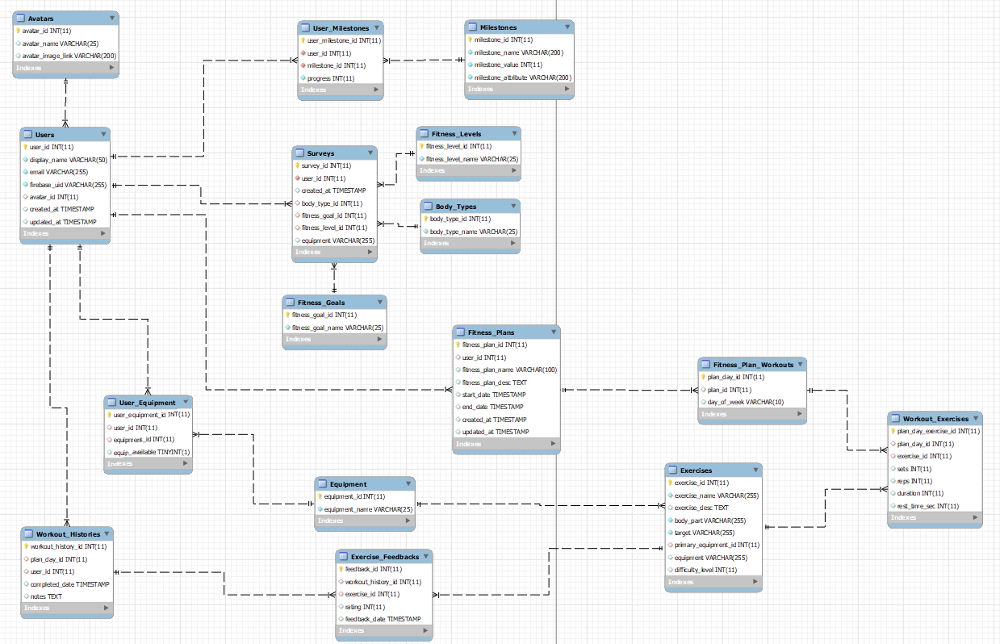

## Below is an image of the current DB schema: 

# Database Outline: 

## Relationship Overview: 
- Users select from a list of Avatars when they register and complete a fitness Survey
- In the Surveys, Users indicate their Body Types, Fitness Goals, Fitness Levels, and Equipment available to them
- In a future iteration, Users will be able to define custom Milestones to measure progress against, or simply defer to the app’s default Milestones.
- Fitness Plan(s) are generated for Users based on the above inputs from the Survey.
- Each Fitness Plan is made up of multiple Workouts
- Each Workout is made up of multiple Exercises that may or may not use Equipment (based on what is available to the User).
- As the User progresses, they provide Exercise Feedback and their Workouts are logged in Workout Histories

## Database Outline, in Words: 

**Avatars** - Records User’s chosen account Avatar from Fitness Survey
- avatar_id: PK, int, auto_increment, not null
- avatar_name: varchar(25), not null
- avatar_image_link: varchar(200)

**Users** - Records user information for those that have created an account in the app
- user_id: PK, int, auto_increment, not null
- display_name: varchar(50), not null
- email: varchar(255), not null
- firebase_uid: varchar(255), not null
- avatar_id: int, FK
- created_at: timestamp
- updated_at: timestamp

**Body Types** - Records Available Body Types from Fitness Survey
- body_type_id: PK, int, auto_increment, not null
- body_type_name: varchar(25), not null

**Fitness Goals** - Records Available Fitness Goal from Fitness Survey
- fitness_goal_id: PK, int, auto_increment, not null
- fitness_goal_name: varchar(25), not null

**Fitness Levels**- Records User’s selected Fitness Level from Fitness Survey
- fitness_level_id: PK, int, auto_increment, not null
- fitness_level_name: varchar(25), not null

**Equipment** – List of Equipment Available for Users to Select
- equipment_id: PK, int, auto_increment, not null
- equipment_name: varchar(25), not null

**User_Equipment** - Intersection Table; maps Users to which pieces of Equipment they have access to
- equipment_id: PK, int, auto_increment, not null
- user_id: int, not null, FK
- equipment_id: int, FK
- equipment_available BOOL

**Fitness Plans** - Records list of Fitness Plans created by App
- fitness_plan_id: PK, int, auto_increment, not null
- user_id: int, FK
- fitness_plan_name: varchar(100)
- fitness_plan_desc: TEXT
- start_date: timestamp
- end_date: timestamp
- created_date: timestamp
- updated_at: timestamp

**Fitness_Plan_Workouts** - Intersection Table; Records Workouts that make up each Fitness Plan
- plan_day_id: PK, int, auto_increment, not null
- plan_id: int, not null, FK
- workout_id: int, not null, FK
- day_of_week: VARCHAR(10)

**Workouts** - Collection of Exercises
- workout_id: PK, int, auto_increment, not null
- workout_name: varchar(200), not null

**Workout_Exercises** - Intersection Table; Records which Exercises are included in Each Workout
- plan_day_exercise_id: PK, int, auto_increment, not null
- plan_day_id: int, not null, FK
- exercise_id: int, not null, FK
- sets: int
- reps: int
- duration int
- rest_time_sec int

**Exercises** - List of Exercises, Makes up Exercise Library
- exercise_id: PK,int, auto_increment, not null
- exercise_name: varchar(255), not null
- exercise_desc: TEXT
- body_part: varchar(255), not null
- target VARCHAR(255)
- primary_equipment_id: int, not null, FK
- difficulty_level: int, not null

**Exercise_Feedback** - Stores Feedback from Users per Exercise in Workout History
- feedback_id: PK, int, auto_increment, not null
- workout_history_id: int, not null, FK
- exercise_id: int, not null, FK
- rating: int, not null
- feedback_date: timestamp, not null

**Workout_Histories** - Record of Workouts Completed per User
- workout_history_id: PK, int, auto_increment, not null
- workout_id: int, FK
- user_id: int, FK
- completed_date: timestamp
- notes: TEXT

**Milestones** - Lists Milestones Created by Users + App’s Default Milestones to celebrate
- milestone_id: PK, int, auto_increment, not null
- milestone_name: varchar(200), not null
- milestone_attribute: varchar(200), not null
- milestone_value: int, not null

**User_Milestones** - Intersection Table; maps User to their Milestone(s)
- user_milestone_id: PK, int, auto_increment, not null
- user_id: int, not null, FK
- milestone_id: int, not null, FK
- progress: int, default 0
  
